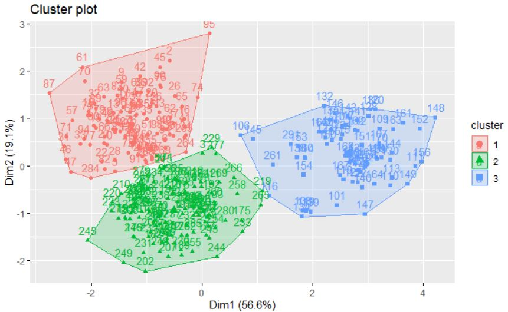
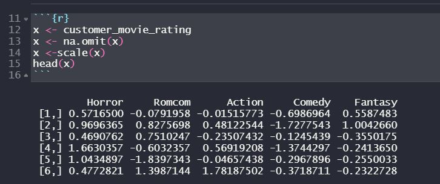
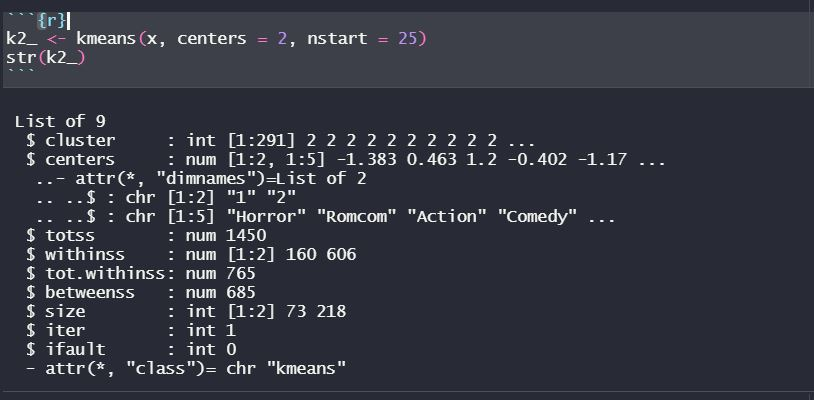
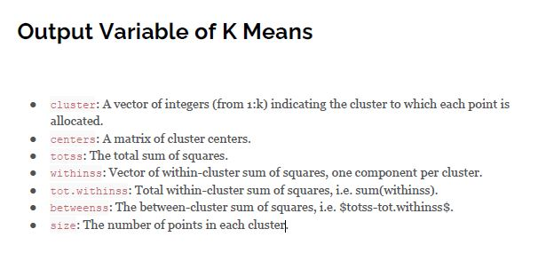
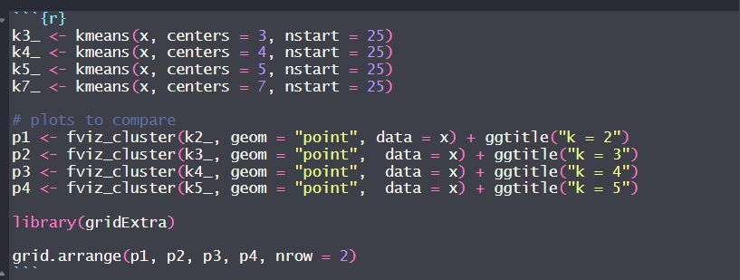
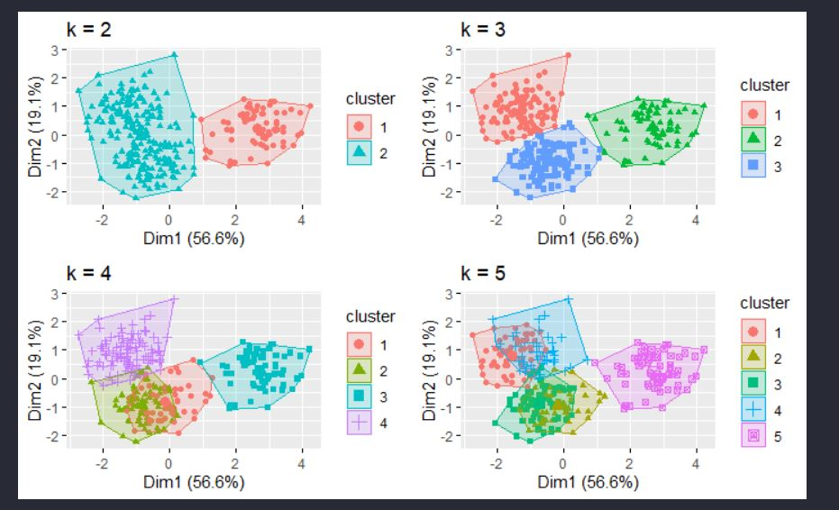
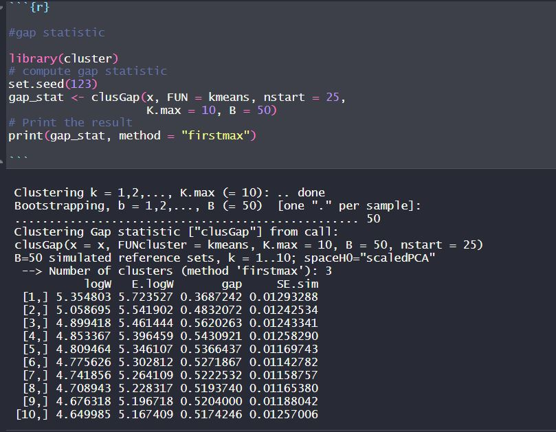
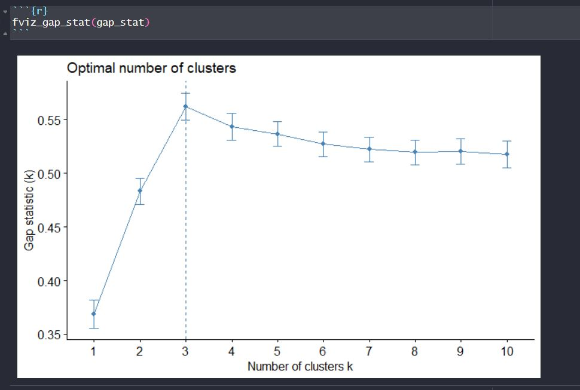
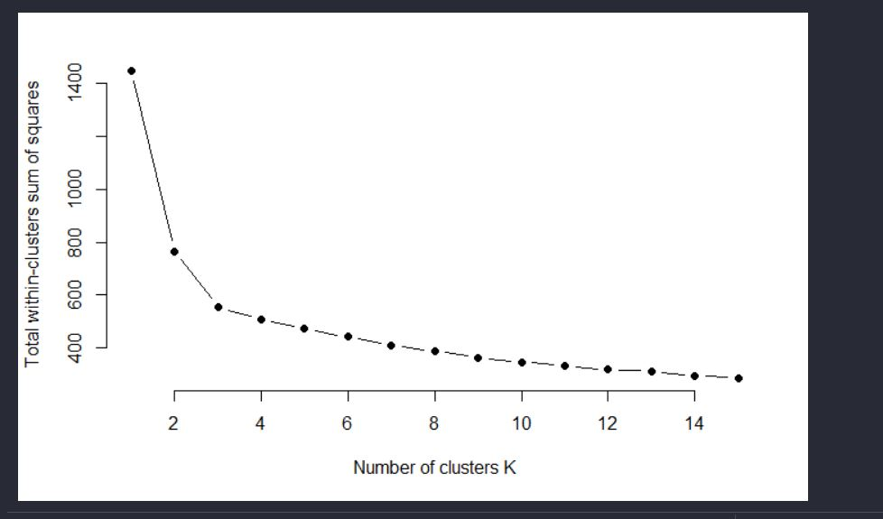

## K-Means Clustering 

K_Means Clustering is a broad set of
techniques for finding subgroups
of observations within a data set. This project can be categroized in unsupervised machine learning.

K-Means Clustering Usage:

1.Customer Segmentation
2.Fraud Detection
3.Document Classification

The classification of observations into groups requires some methods for computing the distance
or the (dis)similarity between each pair of observations. The result of this computation is known
as a dissimilarity or distance matrix. There are many methods to calculate this distance
information.

The basic idea behind kmeans clustering consists of defining clusters so that the total intra
cluster variation (known as total within cluster variation) is minimized. There are several 
k-means algorithms available. The standard algorithm is the Hartigan Wong algorithm (1979)

Particularly to this project, the main object is to cluster the rating of the movie respected to its genres.

Steps:

1. Data Preparation 

- Rows are observations (individuals) and columns are variables

- Any missing value in the data must be removed or estimated.

- The data must be standardized (i.e., scaled) to make variables comparable. Recall that,
standardization consists of transforming the variables such that they have mean zero
and standard deviation one. 

2. Computing K-Mean

 
 The output means :
 
 
 
 
3. Determine the optimal k amount (cluster)

Before determining the amount of k, it is also possible to see the glimpse of the K-means visualization result 

From the visualization, we can see the broadset of the k-mean clustering. 
Knowing that each K-amount would simply take account the group of set corresponds to Unsupervised Machine learning. 

Then we can start analyzing further. There are two (profound) methods used: 

1. Gap Statistic 

The gap statistic compares thetotal intracluster variation fordifferent values of k with their
expected values under nullreference distribution of the data(i.e. a distribution with no obvious clustering.

3. Elbow Method

the basic idea behind cluster partitioning methods, such as
k means clustering, is to define clusters such that the total
intra cluster variation (known as total within cluster
variation or total within cluster sum of square) is
minimized.

Through both method, the value of K obtained is 3. We can actually see the glimpse of the visualization, 
k = 3  gives quite considerable "illustration". 
However comparing the other methods are also possible and this depends on the insight objectiveness.

As we choose k = 3, the insight that can be determined is:

Cluster 1 : Film Action has the highest rating and Romcom has the lowest one.
Cluster 2 : Film Comedy has the highest rating and horror has the lowest one
Cluster 3 :The highest rating goes to horror film while Romcom is the lowest.

You can see the repository file on my github: 

k_means_clustering_movie_rating.Rmd  https://github.com/fadhilhilmi/fadhilhilmi.github.io/blob/master/k_means_clustering_movie_rating.Rmd

Dataset can be downloaded on https://github.com/fadhilhilmi/fadhilhilmi.github.io/blob/master/data_cleansing_exercise.rar
